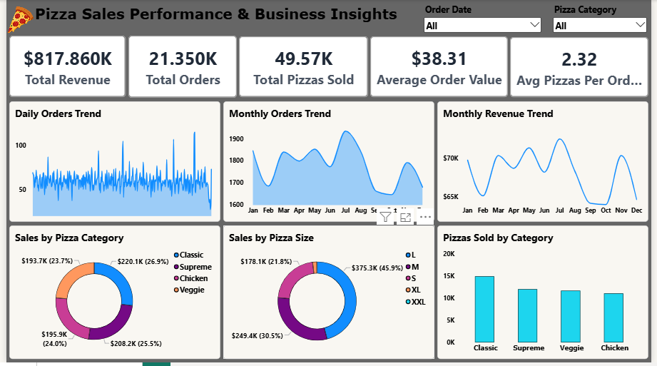
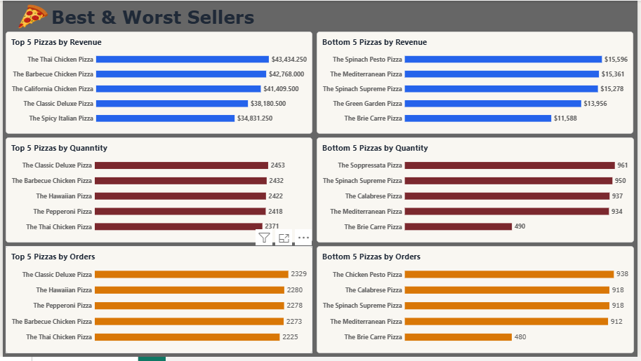

# Pizza Sales Performance & Business Insights

A sales analysis and Power BI dashboard project built using **MySQL, SQL, and Power BI** to analyze pizza sales performance and identify key business insights.

## Project Overview

In this project, I worked with pizza sales data from four main tables:

* `orders`
* `order_details`
* `pizzas`
* `pizza_types`

I joined the tables in MySQL and created a `pizza_sales` view for further analysis.

The analyzed data was then used in Power BI to create an interactive sales dashboard.

## Tools Used

* **MySQL**
* **SQL**
* **Power BI**

## SQL Analysis

The SQL analysis covers:

* Total Revenue
* Average Order Value
* Total Pizzas Sold
* Total Orders
* Average Pizzas Per Order
* Daily Order Trend
* Monthly Order Trend
* Monthly Revenue
* Revenue by Pizza Category
* Revenue by Pizza Size
* Pizzas Sold by Category
* Best & Worst Selling Pizzas

## Power BI Dashboard

The dashboard includes:

* KPI cards for key sales metrics
* Daily Order Trends
* Monthly Orders
* Monthly Revenue Trend
* Sales by Pizza Category
* Sales by Pizza Size
* Pizzas Sold by Category

These visuals provide a quick view of overall sales performance and help compare different categories, sizes, and time periods.

## Business Insights

* **July recorded the highest number of orders with 1,935 orders.**
* **July generated the highest monthly revenue of 72,557.90.**
* Sales performance was analyzed across different pizza categories and sizes.
* Daily and monthly trends were used to understand changes in order volume and revenue.

## Dashboard Preview

### Dashboard Overview



### Dashboard Insights



## Project Structure

```text
Pizza-Sales-Performance-Business-Insights
│
├── Power BI
│   └── Pizza Sales Project.pbix
│
├── SQL
│   ├── 01_pizza_sales_view.sql
│   └── 02_pizza_sales_analysis.sql
│
├── Screenshots
│   ├── dashboard-overview.png
│   └── dashboard-insights.png
│
└── README.md
